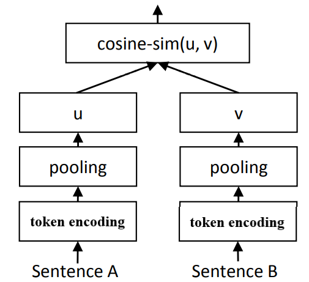

# semantic_matching

## 简介
   这是一个轻量的语义匹配库，主要包含文本编码器、索引两个组件。编码器实现了包括siamese-cbow、
   multihead attention、transformer和bert等多种模型, 索引组件包括Annoy索引和Faiss索引。

## 编码器
语义匹配模型均采用下图所示的孪生网络结构，这种结构也叫双编码器(dual encoder)结构。句子首先进行
token级别的编码，然后通过池化操作得到句子的编码(句向量)，最后再计算句子向量的余弦相似度作为两
个句子的匹配程度。训练时支持同批负采样训练方式(in-batch negative)，并使用对比损失函数
(Contrastive Loss)。

### 困难负样本采样
研究表明训练时双编码器时，随机采样的负样本通常与正样本很容易区分，这样训练出来的编码器效果欠佳，
可以加入一些困难负样本(hard negative)进行训练来提高模型的效果。这里实现了一种利用索引的采样
方法，首先使用随机负采样训练一个初始模型，然后用该模型编码训练集的句子并构建索引。对一个正样本
句子对，借助索引找到与相似度高的一些句子当做负样本。

## 索引
编码器训练完后，即可对句子进行编码并构建索引，在线服务时对于一个query句子，先用编码器对它进行编码，
然后再通过索引检索最相似的句子，最后根据阈值判断是否匹配（或者把检索出来的句子当做候选，再过一个
排序模型找到最终匹配的句子）。Annoy和Faiss是两个常用的向量最近邻检索框架，这里基于这两个库实现了
两个索引组件，使用起来很方便。

## 参考文献
1. Reimers, Nils, and Iryna Gurevych. "Sentence-bert: Sentence embeddings using siamese bert-networks." arXiv preprint arXiv:1908.10084 (2019).

2. Ding, Yingqi Qu Yuchen, et al. "RocketQA: An Optimized Training Approach to Dense Passage Retrieval for Open-Domain Question Answering." arXiv preprint arXiv:2010.08191 (2020).

3. Gao, Tianyu, Xingcheng Yao, and Danqi Chen. "SimCSE: Simple Contrastive Learning of Sentence Embeddings." arXiv preprint arXiv:2104.08821 (2021).

4. Kenter, Tom, Alexey Borisov, and Maarten De Rijke. "Siamese cbow: Optimizing word embeddings for sentence representations." arXiv preprint arXiv:1606.04640 (2016).
